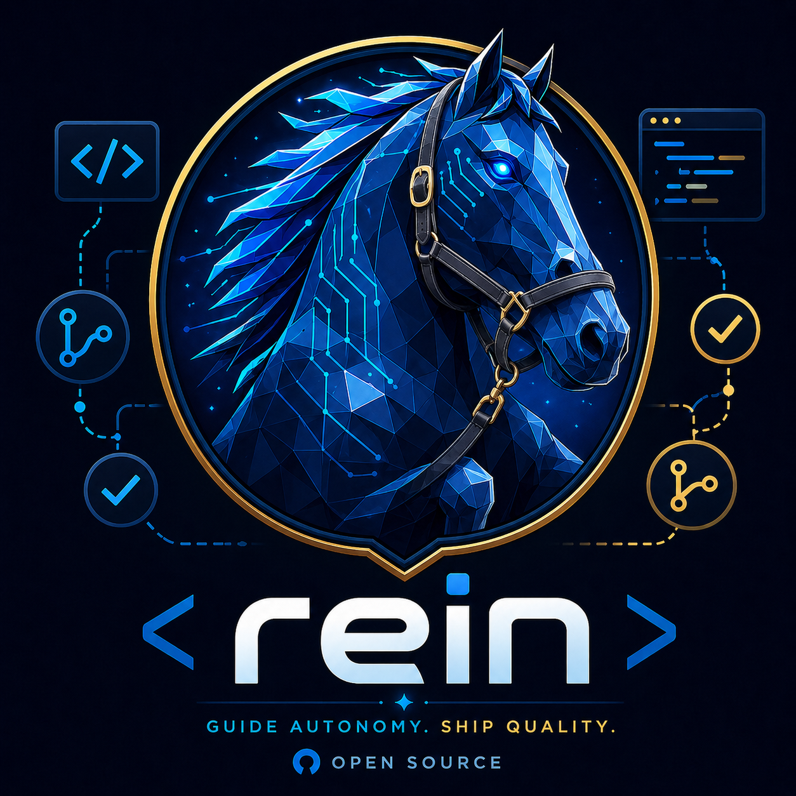

<div align="right">
  <a href="README.ko.md">한국어</a> · <strong>English</strong>
</div>

<div align="center">

  

  <p>
    <strong>GUIDE AUTONOMY. SHIP QUALITY.</strong>
    <br>
    A Claude Code plugin that lets your AI agent move at full speed — while requiring it to plan, leave evidence, and pass review before code lands.
  </p>

  <p>
    <a href="https://github.com/JayJihyunKim/rein/issues/new?labels=bug">Report Bug</a>
    ·
    <a href="https://github.com/JayJihyunKim/rein/issues/new?labels=enhancement">Request Feature</a>
    ·
    <a href="docs/agents-md-examples.md">AGENTS.md Examples</a>
  </p>

  <p>
    <a href="https://github.com/JayJihyunKim/rein/releases">
      
    </a>
    <a href="LICENSE">
      
    </a>
    <a href="https://github.com/JayJihyunKim/rein/stargazers">
      
    </a>
    
    
  </p>

</div>

---

## What Rein is

Rein is a Claude Code plugin for teams that let an AI agent write production code but don't want to rely on prompt discipline alone. It adds a small set of repo-level guardrails so the agent has to **define the task**, **leave an evidence trail**, and **pass review** before code is committed.

**Use Rein if**:

- You maintain a long-lived codebase
- Consistency of AI output matters more to your team than raw speed
- You want code review, evidence, and checkpoints **codified as team discipline**, not held in people's heads

**Don't use Rein if**:

- You write throwaway scripts or one-shot projects
- Your team doesn't want process files in the repo
- You run outside POSIX bash / WSL2 (native Windows PowerShell is unsupported)

> **Tool support**: Rein's automatic guardrails are built on Claude Code's hook lifecycle. The same conventions (AGENTS.md, rule files) work as **reference documents only** in Cursor / Copilot — there is no automatic blocking outside Claude Code.

---

## What changes — a 30-second example

**Without Rein — typical flow**

```
Developer: "Add a login feature"
   ↓
AI: writes code → git commit
   ↓
No review. No definition of done.
The next session has no record of what was done or why.
```

**With Rein — same request**

```
Developer: "Add a login feature"
   ↓
Rein: "First, write the completion criteria to trail/dod/dod-2026-04-22-login.md"
   → AI writes the checklist (DoD file)
   ↓
AI edits source code (allowed, because a DoD exists)
   ↓
AI tries git commit
   → Rein: "No review record found. Blocked."
   → AI runs codex review → review record created → commit allowed
   ↓
At session end, decisions and changes are logged to trail/inbox/.
The next session auto-loads trail/index.md (the project state summary)
so context carries over.
```

---

## Why AI-Native

| | AI-Assisted (typical) | AI-Native (Rein) |
|---|---|---|
| How you instruct | "Write this function" | "Run this workflow" |
| Where standards live | In someone's head | In `AGENTS.md`, `rules/`, `trail/` |
| When output is wrong | Re-prompt the AI | Update the rule that let it through |
| Scaling effect | A human reviews every change | Rules accumulate; quality compounds |

In an AI-assisted workflow, every fix is a re-prompt. In an AI-native workflow, every fix is a rule that prevents the same mistake next time. Rein makes the second possible.

---

## What you get

1. **Tasks must be defined before code is edited.** A Definition-of-Done file is required before any source edit.
2. **Reviews block commits and tests.** Until a review record exists, `git commit` and test runners are blocked.
3. **Evidence accumulates and rotates automatically.** New work lands in `trail/inbox/`. The next day, yesterday's inbox merges into a `daily/` summary; daily entries older than 7 days merge into `weekly/`. The next session auto-loads `trail/index.md` for project state — older summaries are read on demand.
4. **Updates are handled by Claude Code's plugin manager.** Your customisations are not overwritten because the plugin owns its own files.

---

## Install

> Two commands inside Claude Code, then approve a one-time bootstrap. No shell installer.

```
1. /plugin marketplace add JayJihyunKim/rein
2. /plugin install rein@rein
3. Restart your Claude Code session
4. On first run, Claude will ask whether to initialise Rein in your project — say yes.
```

That's it. Claude scaffolds `trail/` and `.rein/` in your repo on the first session. There is no `curl` installer and no shell command to run.

### Requirements

| Item | Version |
|---|---|
| OS | macOS, Linux, Windows WSL2 |
| Claude Code | Latest |
| git | Any |
| bash | 3.2+ (only for hook execution) |

---

## What gets added to your repo

```
your-repo/
├── .rein/
│   ├── project.json          ← Rein mode + scope (committed)
│   └── policy/               ← repo-local policy templates
│       ├── hooks.yaml
│       └── rules.yaml
├── trail/                    ← evidence store (auto-rotated)
│   ├── inbox/                ← today's completed work (yesterday's entries merge into daily/ on the next session)
│   ├── daily/                ← per-day summaries (entries older than 7 days merge into weekly/)
│   ├── weekly/               ← per-week summaries
│   ├── dod/                  ← Definition-of-Done files
│   ├── decisions/            ← key architectural decisions
│   ├── incidents/            ← hook-block records (used to evolve rules)
│   ├── agent-candidates/     ← new agent suggestions from recurring incident patterns
│   └── index.md              ← current project state (5–25 lines, auto-loaded on session start)
└── .claude/
    └── settings.json         ← one line: plugin pin for `rein`
```

That's all. The framework's **hooks, rules, agents, and skills** ship inside the plugin and live in Claude Code's plugin cache, not in your repo — so plugin updates never overwrite anything. If you want project-specific instructions to ride alongside Rein, add your own `AGENTS.md` (or `.claude/CLAUDE.md`) in your repo; Rein reads them but never modifies them.

> Recommended: add `trail/` and `.claude/cache/` to your `.gitignore` if you don't want session evidence committed (Rein doesn't auto-edit `.gitignore`).

---

## Platform support

| Platform | Status |
|---|---|
| macOS | ✅ Officially supported |
| Linux | ✅ Officially supported |
| Windows (WSL2) | ✅ Officially supported |
| Windows (Git Bash / MSYS2) | ⚠️ Best-effort, not formally tested |
| Windows (PowerShell / CMD native) | ❌ Not supported |

For Windows, **WSL2 (Ubuntu)** is recommended. See [docs/troubleshooting/windows.md](docs/troubleshooting/windows.md) for installation and Git Bash diagnostics.

---

## Troubleshooting

<details>
<summary><code>/plugin marketplace add</code> isn't recognised</summary>

Use a recent version of Claude Code. The marketplace command is a single word: `/plugin` (not `/plugins`).

```
/plugin marketplace add JayJihyunKim/rein
```

</details>

<details>
<summary>Claude doesn't offer to bootstrap on first session</summary>

The bootstrap prompt appears the first time you open Claude Code in a directory that doesn't already have `.rein/project.json`. Make sure you're inside a git repository:

```bash
git init       # initialise a new repo, or
cd your-repo   # move into an existing one
# then start a new Claude Code session
```

</details>

<details>
<summary>All edits are blocked</summary>

If the `everything-claude-code` plugin (>= 1.9.0) is installed alongside Rein, its `gateguard-fact-force` hook conflicts with Rein and causes a deadlock. Rein already provides equivalent coverage, so remove the other plugin:

```bash
claude plugin remove everything-claude-code
```

</details>

<details>
<summary>Rein doesn't work on Windows</summary>

Native Windows (PowerShell / CMD) is not supported. Install WSL2 and run from Ubuntu. See [docs/troubleshooting/windows.md](docs/troubleshooting/windows.md).

</details>

---

## Security

**Do not file security vulnerabilities as public GitHub issues.**

If you discover a vulnerability, please report it privately via GitHub Security Advisories: [Report a vulnerability](https://github.com/JayJihyunKim/rein/security/advisories/new).

---

## Contributing

Issues and pull requests are welcome.

1. Fork the repo
2. Create a feature branch: `git checkout -b feat/amazing-feature`
3. Commit your changes: `git commit -m "feat: add amazing feature"`
4. Push the branch: `git push origin feat/amazing-feature`
5. Open a Pull Request

Before submitting, read [`AGENTS.md`](AGENTS.md) to understand the framework structure and the rules that govern contributions.

| Commit type | When to use |
|---|---|
| `feat:` | New feature |
| `fix:` | Bug fix |
| `docs:` | Documentation change |
| `refactor:` | Code change with no behavioural difference |
| `test:` | Test change |
| `chore:` | Maintenance |

---

## Release history

Latest release: **v1.0.0** (2026-04-30) — plugin-only OSS launch

For prior dev-cycle history (v0.x), see [docs/changelog-archive/2026-04-pre-v1.md](docs/changelog-archive/2026-04-pre-v1.md).

Full release notes: [CHANGELOG.md](CHANGELOG.md)

---

## License

MIT — see [LICENSE](LICENSE).

---

## References

- [agentsmd/agents.md](https://agents.md) — AGENTS.md hierarchy
- [anthropics/skills](https://github.com/anthropics/skills) — skill definitions
- [Shields.io](https://shields.io) — badges

---

<div align="center">
  <sub>Built by <a href="https://github.com/JayJihyunKim">JayJihyunKim</a></sub>
</div>
